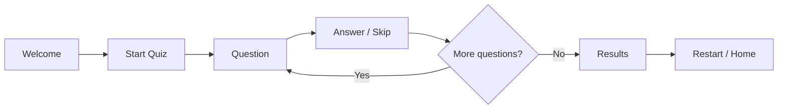

# Islamic Quiz App — تطبيق المسابقة الإسلامية


**Arabic multiple-choice quiz with randomized answers, scoring, and a complete responsive quiz flow.**

[Quiz Data](client/src/lib/quizData.ts) · [Home Flow](client/src/pages/Home.tsx) · [App Router](client/src/App.tsx)

Interactive Arabic quiz application built with **React + TypeScript**. It presents Islamic general-knowledge questions through a simple responsive interface, randomizes answer choices, tracks results, and provides a complete quiz flow from welcome screen to final score.

## Portfolio Proof

| Area | Evidence |
|---|---|
| **Problem** | Turn a static set of Arabic questions into an interactive practice experience with clear progression and results. |
| **Solution** | React/TypeScript quiz flow with shuffled options, answer tracking, skipping, results, and restart behavior. |
| **Question source** | [quizData.ts](client/src/lib/quizData.ts) |
| **Quiz state** | [Home.tsx](client/src/pages/Home.tsx) |
| **Routing / app shell** | [App.tsx](client/src/App.tsx) |
| **Current status** | Runnable application; no backend or account system is required for the quiz experience. |

## Features

- Arabic-first interface.
- Multiple-choice questions.
- Randomized answer ordering.
- Correct / incorrect answer tracking.
- Skip-question support.
- Final results screen.
- Restart and return-home flows.
- Responsive UI.
- Client-side routing and error handling.

## Tech Stack


The UI also uses Radix-based components, Wouter routing, React Hook Form, Zod, and Framer Motion dependencies.

## Application Flow



Question data is maintained in:

```text
client/src/lib/quizData.ts
```

The application shuffles answer choices while preserving the correct-answer mapping.

## Development

Install dependencies:

```bash
pnpm install
```

Start development mode:

```bash
pnpm dev
```

Type-check:

```bash
pnpm check
```

Build for production:

```bash
pnpm build
```

Run the production server:

```bash
pnpm start
```

## Architecture

The frontend is a Vite/React application and the repository includes a lightweight Express server for serving the production build and supporting client-side routing.
